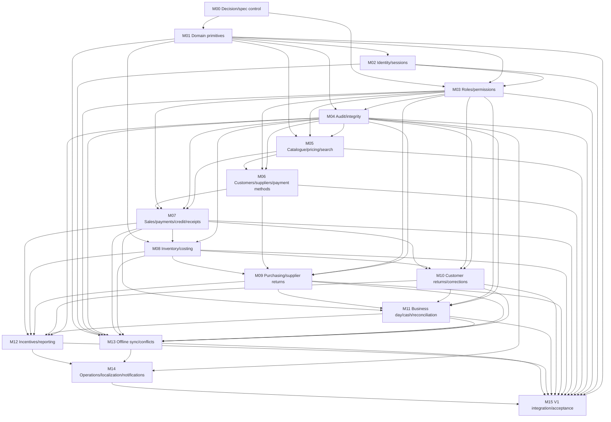
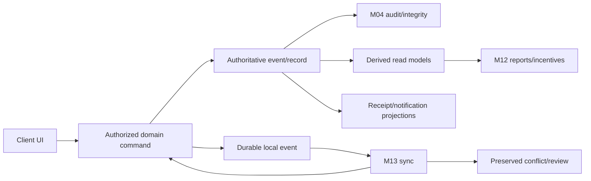

# Sabi Shop Dependency Graph

This graph is the integration contract for the build. Arrows point from a
dependency to the module that consumes it. A downstream module must not
redefine an upstream module's authority.

## 1. Module graph

## 2. Contract boundaries

| Boundary | Authoritative owner | Consumers | Prohibited shortcut |
|---|---|---|---|
| Business/user/device identity | M02 | Every command and sync path | UI-selected business context without server validation |
| Role/approval decision | M03 | M04, M07–M13 | Treating hidden controls or offline status as permission |
| Historical evidence | M04 | All consequential modules, reports | Updating/deleting a completed record in place |
| Product identity and price | M05 | M06–M10 | Inventory or POS inventing SKU/price policy |
| Customer/supplier/payment classification | M06 | M07, M09–M12 | POS deciding whether a method is cash by label |
| Sale/payment/debt event | M07 | M08, M10–M13 | Inventory or reporting fabricating sale/payment truth |
| Inventory/cost | M08 | M07, M09, M10, M12, M13 | Quantity overwrite or recalculating prior COGS from current cost |
| Supplier liability/return | M09 | M08, M11, M12 | Recording a supplier return as a customer refund/cash event |
| Customer return/correction | M10 | M04, M07, M08, M11, M12, M13 | Calling a correction a deletion or silently reversing evidence |
| Cash/session truth | M11 | M12–M15 | Using performance revenue or a dashboard estimate as physical cash |
| Derived reporting/incentives | M12 | UX/operations | Mutating source records to make a report balance |
| Sync state/conflict | M13 | Every offline-capable module | Last-write-wins for consequential records without preserved evidence |
| Operational messaging/recovery | M14 | Users, release controls | Swallowing failures or exposing secrets in logs/messages |

## 3. Required state/data flow

The client may optimize reads and queue writes, but only the authoritative
command boundary can accept consequential business truth. Local state must
retain enough metadata to explain whether it is local, pending, synchronized,
retrying, conflicting, rejected, or superseded.

## 4. Integration order and evidence

1. M00–M04 establish IDs, tenant boundaries, authorization, audit, and state
   transitions before feature commands.
2. M05–M06 establish stable references and classifications before sales or
   purchasing.
3. M07–M11 implement source events and cross-domain effects. Each slice must
   include its failure and authorization tests before the next slice consumes
   it.
4. M12 reads source events only; M13 can transport events but cannot bypass M03
   or M04.
5. M14 supplies recovery/operations evidence; M15 rejects a release when any
   upstream contract is unverified.

## 5. Handoff dependency checklist

Before handing a module downstream, provide:

- module ID, owner, scope, and forbidden responsibilities;
- versioned public interfaces and migration/schema changes;
- inputs/outputs and authoritative versus derived fields;
- state transitions, invariants, authorization and self-approval behavior;
- local/offline/retry/conflict behavior and reporting consequences;
- normal, failure, security, and recovery test evidence;
- known limitations and unresolved decisions;
- consumer-facing compatibility notes and the next integration test.

